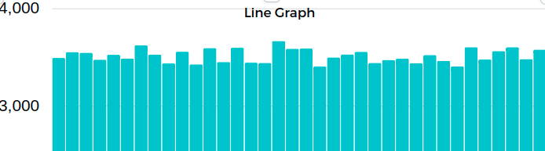

# Poisson distribution for roullete

Ispired by comment on Youtube:

## Results

Contract in devnet: `0:185bf0dc0828923d6b99368dfe28cd0ef86a5e58236e82876095fa74a0f1c4c3`
Executions: 130037
Gas: 20000 tokens
Time: 11 hours

### Received Data

Count of numbers between first and last numbers | Combinations
--- | ---
0|3490
1|3549
2|3542
3|3471
4|3522
5|3483
6|3619
7|3524
8|3433
9|3553
10|3424
11|3590
12|3448
13|3594
14|3441
15|3438
16|3664
17|3583
18|3586
19|3402
20|3494
21|3525
22|3552
23|3438
24|3468
25|3482
26|3436
27|3519
28|3460
29|3403
30|3599
31|3473
32|3559
33|3599
34|3477
35|3574

### Conclusion

There no Poisson distribution for roulette on TVM blockchain